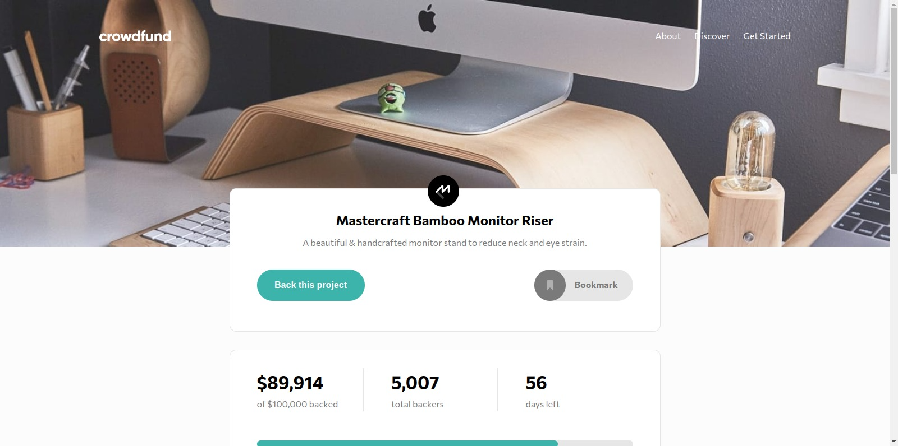

# Frontend Mentor - Crowdfunding product page solution -> Ongoing project

This is a solution to the [Crowdfunding product page challenge on Frontend Mentor](https://www.frontendmentor.io/challenges/crowdfunding-product-page-7uvcZe7ZR). Frontend Mentor challenges help you improve your coding skills by building realistic projects.

## Table of contents

- [Overview](#overview)
  - [The challenge](#the-challenge)
  - [Screenshot](#screenshot)
  - [Links](#links)
- [My process](#my-process)
  - [Built with](#built-with)
  - [Continued development](#continued-development)
  - [Useful resources](#useful-resources)
- [Author](#author)

## Overview

### The challenge

Users should be able to:

- View the optimal layout depending on their device's screen size
- See hover states for interactive elements
- Make a selection of which pledge to make
- See an updated progress bar and total money raised based on their pledge total after confirming a pledge
- See the number of total backers increment by one after confirming a pledge
- Toggle whether or not the product is bookmarked

### Screenshot



### Links

- Solution URL: [Crowfunding product page](https://github.com/tabascum/crowdfunding-product-page)
- Live Site URL: [Crowfunding product page](https://tabascum-crowdfunding-product-page.netlify.app)

## My process

### Built with

- Semantic HTML5 markup
- CSS custom properties
- Flexbox
- [Vue](https://vuejs.org/) - JS library
- [Pinia](https://pinia.vuejs.org/) - Store library for vue

### Continued development

I'll be practicing more the use of Vue, since there's a lot of room to learn and develop better practices on views, reusable components, as well as Pinia and it's stores concept.

### Useful resources

- [Learn Vue](https://learnvue.co/) - This helped me understand several concepts. Also, it's a good source, along with the official documentation, of tutorials, articles and their Youtube Channel is a good help to understand and get things done.

## Author

- Frontend Mentor - [@tabascum](https://www.frontendmentor.io/profile/tabascum)

````
### Steps yet to do:

### Compile and Minify for Production

```sh
npm run build
````

### Lint with [ESLint](https://eslint.org/)

```sh
npm run lint
```
